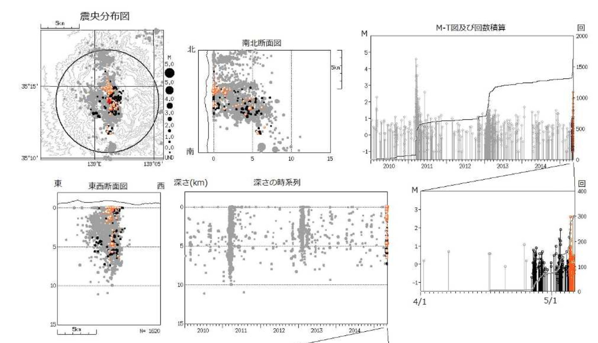

Making Subterranean Map
==========================

On May 3, 2015, Japan's Meteorological Agency issued the volcanic alert for Hakone, most popular destination for foreign tourists, restricting access to the area 300 meters from Owakudani. 

The agency's press release was like this.

Obviously, they have depth data.

I found researchers network, JMA Unified Hypocenter Catalogs <https://hinetwww11.bosai.go.jp/auth/?LANG=en> , asked for a user account and permission to use.

------------------------
Elevation data
------------------------

Terrain data is called DEM, digital elevation model. DEM is a collection of representative height of each latitude/longitude grid cell. (Possibly point height of each center of the cell)

In Japan, Geospatial Information Authority(GSI) publishes 10 meter mesh of DEM for whole country and 5 meter mesh for volcanic area.

In this page, I use Aster Global DEM, 30 meter mesh for whole globe, maintained by NASA amd Japan's METI. 

In Earth Explorer: <http://earthexplorer.usgs.gov>, select ASTER GLOBAL DEM as dataset and download 2 files which seem to cover Hakone area.

.. image:: _static/images/earth_explorer_asterGDEM.png

Check two DEM files by droppong onto QGIS.

.. image:: _static/images/ASTER_QGIS.png

You can easily, by QGIS, merge files into a single file and clip area as you want. In this page, I use GDAL/OGR directly from command line. (because I want to clip data exactly)

What I want is:

* Owakudani (lon,lat) = (139.027287, 35.245254)
* clip area [northwest, southeast] = [(138.9,35.35), (139.1,35.15)]
::

	$ gdal_merge.py \
		-of GTiff \
		-o hakoneDEM.tif \
		ASTGTM2_N35E138/ASTGTM2_N35E138_dem.tif \
		ASTGTM2_N35E139/ASTGTM2_N35E139_dem.tif
	$ gdal_translate \
		-projwin 138.9 35.35 139.1 35.15 \
		-of GTiff \
		hakoneDEM.tif \
		owakudaniDEM.tif

Check by gdalinfo instead of QGIS this time.
::

	$ gdalinfo owakudaniDEM.tif
	Driver: GTiff/GeoTIFF
	Files: owakudaniDEM.tif
	Size is 720, 720
	Coordinate System is:
	GEOGCS["WGS 84",
	    DATUM["WGS_1984",
	        SPHEROID["WGS 84",6378137,298.257223563,
	            AUTHORITY["EPSG","7030"]],
	        AUTHORITY["EPSG","6326"]],
	    PRIMEM["Greenwich",0],
	    UNIT["degree",0.0174532925199433],
	    AUTHORITY["EPSG","4326"]]
	Origin = (138.899861111111107,35.350138888888893)
	Pixel Size = (0.000277777777778,-0.000277777777778)
	Metadata:
	  AREA_OR_POINT=Area
	Image Structure Metadata:
	  INTERLEAVE=BAND
	Corner Coordinates:
	Upper Left  ( 138.8998611,  35.3501389) (138d53'59.50"E, 35d21' 0.50"N)
	Lower Left  ( 138.8998611,  35.1501389) (138d53'59.50"E, 35d 9' 0.50"N)
	Upper Right ( 139.0998611,  35.3501389) (139d 5'59.50"E, 35d21' 0.50"N)
	Lower Right ( 139.0998611,  35.1501389) (139d 5'59.50"E, 35d 9' 0.50"N)
	Center      ( 138.9998611,  35.2501389) (138d59'59.50"E, 35d15' 0.50"N)
	Band 1 Block=720x5 Type=Int16, ColorInterp=Gray

Do you notice that clipped area is a little different from intention? Clipped data is bigger than instructed.

Metadata:AREA_OR_POINT=Area means height data is representative height of each cell(that is pixel) in the grid. But I use this as point data so as to simplify mesh construction.

call my function to get binary height-only data.
::
	python dem2npy.py owakudaniDEM.tif

In case of Hong Kong area, you can use uint8(0~256) instead of int16(-32768~32767), I am right?

owakudaniDEM.npy is multipled by 10; first value is Upper Left, second is 1 pixel east of the first. You should check it by a binary editor and QGIS.

------------------------
Texture from Landsat
------------------------

Texture is a surface image of 3D graphics. In this page I use Landsat 8 data and CREATE an image.

.. image:: _static/images/earth_explorer_landsat8.png

Find and download Level-1 production of cloudless image. In this case, LC81070362015122LGN00.tar

Level-1 production is composed of B1~B11 geoTiff files and BQA/MTL files.
Visible lights are Band2(blue), Band3(green) and Band4(red). Band8 is panchromatic(colorless), having 15 meter resolution. 

.. image:: _static/images/landsat8.png

Pansharpening is an operation which color-paints panchromatic image with less precise RGB images. There are several ways.

* arcGIS (easiest but expensive)
* gdal_pansharpen (wait for GDAL 2.1)
* write program (PanSharpening)

::

	# write out geometric information (tfw world file)
	listgeo -tfw LC81070362015122LGN00/LC81070362015122LGN00_B8.TIF

	./PanSharpening \
		--r LC81070362015122LGN00/LC81070362015122LGN00_B4.TIF \
		--g LC81070362015122LGN00/LC81070362015122LGN00_B3.TIF \
		--b LC81070362015122LGN00/LC81070362015122LGN00_B2.TIF \
		--pan LC81070362015122LGN00/LC81070362015122LGN00_B8.TIF \
		--weight 0.52 0.23 0.35 \
		--o LC81070362015122LGN00/LC81070362015122LGN00_PAN_NOINFO.TIF

	# this pansharpned image has no geometric information
	# join world file to newly-created pan image
	geotifcp -e LC81070362015122LGN00/LC81070362015122LGN00_B8.TIF LC81070362015122LGN00/LC81070362015122LGN00_PAN_NOINFO.TIF LC81070362015122LGN00/LC81070362015122LGN00_PAN.TIF

	# clip the same area as DEM file
	$ gdal_translate \
		-projwin 138.9 35.35 139.1 35.15 \
		-of GTiff \
		LC81070362015122LGN00/LC81070362015122LGN00_PAN.TIF \
		owakudaniRGB.tif
	# this causes error. Projection is different. Check.

	$ gdalinfo LC81070362015122LGN00/LC81070362015122LGN00_PAN.TIF
	Driver: GTiff/GeoTIFF
	Files: LC81070362015122LGN00/LC81070362015122LGN00_PAN.TIF
	Size is 15501, 15821
	Coordinate System is:
	PROJCS["WGS 84 / UTM zone 54N",
		GEOGCS["WGS 84",
			DATUM["WGS_1984",
    	        SPHEROID["WGS 84",6378137,298.257223563,
    	            AUTHORITY["EPSG","7030"]],
    	        AUTHORITY["EPSG","6326"]],
    	    PRIMEM["Greenwich",0],
	        UNIT["degree",0.0174532925199433],
	        AUTHORITY["EPSG","4326"]],
	    PROJECTION["Transverse_Mercator"],
	    PARAMETER["latitude_of_origin",0],
	    PARAMETER["central_meridian",141],
	    PARAMETER["scale_factor",0.9996],
	    PARAMETER["false_easting",500000],
	    PARAMETER["false_northing",0],
	    UNIT["metre",1,
	        AUTHORITY["EPSG","9001"]],
	    AUTHORITY["EPSG","32654"]]
	Origin = (261892.500000000000000,3948907.500000000000000)
	Pixel Size = (15.000000000000000,-15.000000000000000)
	Metadata:
	  AREA_OR_POINT=Area
	Image Structure Metadata:
	  INTERLEAVE=PIXEL
	Corner Coordinates:
	Upper Left  (  261892.500, 3948907.500) (138d22'11.30"E, 35d39'19.18"N)
	Lower Left  (  261892.500, 3711592.500) (138d26'10.92"E, 33d31' 2.69"N)
	Upper Right (  494407.500, 3948907.500) (140d56'17.50"E, 35d41' 2.57"N)
	Lower Right (  494407.500, 3711592.500) (140d56'23.14"E, 33d32'38.19"N)
	Center      (  378150.000, 3830250.000) (139d40'15.78"E, 34d36'24.72"N)
	Band 1 Block=15501x1 Type=UInt16, ColorInterp=Gray
	Band 2 Block=15501x1 Type=UInt16, ColorInterp=Undefined
	Band 3 Block=15501x1 Type=UInt16, ColorInterp=Undefined

	# EPSG is 32654, not 4326 of DEM file. So change it to 4326 (You can do it by QGIS)
	$ gdalwarp -overwrite \
	   -s_srs EPSG:32654 \
	   -t_srs EPSG:4326 \
	   -r cubic \
	   -of GTiff LC81070362015122LGN00/LC81070362015122LGN00_PAN.TIF \
	   LC81070362015122LGN00/LC81070362015122LGN00_PAN_4326.TIF

	# Now that you can safely clip the image
	$ gdal_translate -projwin 138.9 35.35 139.1 35.15 -of GTiff LC81070362015122LGN00/LC81070362015122LGN00_PAN_4326.TIF owakudaniRGB.tif

	# check again
	$ gdalinfo owakudaniRGB.tif
	Driver: GTiff/GeoTIFF
	Files: owakudaniRGB.tif
	Size is 1332, 1332
	Coordinate System is:
	GEOGCS["WGS 84",
	    DATUM["WGS_1984",
	        SPHEROID["WGS 84",6378137,298.257223563,
	            AUTHORITY["EPSG","7030"]],
	        AUTHORITY["EPSG","6326"]],
	    PRIMEM["Greenwich",0],
	    UNIT["degree",0.0174532925199433],
	    AUTHORITY["EPSG","4326"]]
	Origin = (138.899891210746461,35.350078925110978)
	Pixel Size = (0.000150166188241,-0.000150166188241)
	Metadata:
	  AREA_OR_POINT=Area
	Image Structure Metadata:
	  INTERLEAVE=PIXEL
	Corner Coordinates:
	Upper Left  ( 138.8998912,  35.3500789) (138d53'59.61"E, 35d21' 0.28"N)
	Lower Left  ( 138.8998912,  35.1500576) (138d53'59.61"E, 35d 9' 0.21"N)
	Upper Right ( 139.0999126,  35.3500789) (139d 5'59.69"E, 35d21' 0.28"N)
	Lower Right ( 139.0999126,  35.1500576) (139d 5'59.69"E, 35d 9' 0.21"N)
	Center      ( 138.9999019,  35.2500682) (138d59'59.65"E, 35d15' 0.25"N)
	Band 1 Block=1332x1 Type=UInt16, ColorInterp=Gray
	Band 2 Block=1332x1 Type=UInt16, ColorInterp=Undefined
	Band 3 Block=1332x1 Type=UInt16, ColorInterp=Undefined

.. image:: _static/images/pansharpened.png

owakudaniRGB.tif is 3-band geotiff image, not RGB image. If you open it by usual image softwares, it shows only the first band of the three, in black and white.

When you open it by QGIS, it automatically merges 3 band into RGB color image.
Click on the Layer and save as image, not as value. You get RGB tif with no geometric information.

.. image:: _static/images/saveasimage.png

Use and abuse your photoshop as you want, as it has no geometric information any more.

.. image:: _static/images/photoshopmap.png

**Remember** this geoinfo-less image represents [(138.8998912,35.3500789), (139.0999126,35.1500576)] area even after it is resized.

------------------------
Quake data
------------------------

Next morning, I got my account password and permission to use data from JMA Unified Hypocenter Catalogs.

The data looked like this.

.. image:: _static/images/originaldata.jpg

What I filtered is this. 

.. image:: _static/images/trimmeddata.png

This is a good training for text manipulation by scripting language (Python/Ruby).

------------------------
webGL presentation
------------------------

THREE.js is the most popular library and I used it for the first version of Hakone 3D map. But it is too large a library, in many cases larger than geometry data.

I wrote my own wrapper library. I won't elaborate how to use it.

Following points are common in both cases. 

LonLatAlt2XYZ function
^^^^^^^^^^^^^^^^^^^^^^^^^^^^^^^

DEM data and Quake data are longitude/latitude/altitude data. You need to translate it into X/Y/Z data. ECEF(Earth-Centered, Earth-Fixed) Cartesian coordinate system is the best target coordinate.

ECEF system: <https://en.wikipedia.org/wiki/ECEF>

In this case, I adopt a much simpler translation. 

Remember that the length of 1 degree of latitude is about 111000 meters. but that of longitude depends on latitude. At Owakudani (139.027287, 35.245254), 1 degree of longitude is about 90163 meters.
The function below, geoTranslator, returns function which translates (lon(deg),lat(deg),alt(km)) into [x,y,z] array.
::

    geoTranslator = function(offset_x,offset_y,offset_z,scale_x,scale_y,scale_z){
        function fX(x,y,z){return (x - offset_x) * scale_x;};
        function fY(x,y,z){return (y - offset_y) * scale_y;};
        function fZ(x,y,z){return (z - offset_z) * scale_z;};
        var geoTranslator = function(lon,lat,alt){
            return [fX(lon,lat,alt),fY(lon,lat,alt),fZ(lon,lat,alt)];
        };
        geoTranslator.inverse = function(_x, _y, _z){
            return [_x / scale_x + offset_x, _y / scale_y + offset_y, _z / scale_z + offset_z];
        };
        return geoTranslator;
    };
    var geo2xyz = geoTranslator(139.027287, 35.245254, 0, 90163 * 0.001, 110000 * 0.001, 0.001);

    # test
    console.log( geo2xyz(139,35,-0.5) );

By the same token, the function, uvTranslator, returns function which translates (lon(deg),lat(deg)) into [u,v] array. This is used for calculation of uv texture coordinate. 
::

    uvTranslator = function(top,right,left,bottom){
        var w = right - left, h = bottom - top;
        var bClamp = true;
        var uvTranslator = function(x,y){
            var u = (x - left) / w, v = (bottom - y) / h;
            if(bClamp){
                u = (u > 1.0) ? 1.0 : (u < 0.0) ? 0.0 : u;
                v = (v > 1.0) ? 1.0 : (v < 0.0) ? 0.0 : v;
            }
            return [u,v];
        };
        uvTranslator.clamp = function(b){
            bClamp = b;
        }
        return uvTranslator;
    };
    var geo2uv = uvTranslator(35.3500789, 139.0999126, 138.8998912, 35.1500576);

    # test
    console.log( geo2uv(139,35) );

**Recall** the texture image represents [(138.8998912,35.3500789), (139.0999126,35.1500576)].

Terrain geometry
^^^^^^^^^^^^^^^^^^^^^^^^^^^^^^^

After having loaded owakudaniDEM.npy, you have to construct terrain geometry.
You had inspected owakudaniDEM.tif before and gotten these information.
::

	$ gdalinfo owakudaniDEM.tif
	Driver: GTiff/GeoTIFF
	Files: owakudaniDEM.tif
	Size is 720, 720
	....
	Origin = (138.899861111111107,35.350138888888893)
	Pixel Size = (0.000277777777778,-0.000277777777778)

.. image:: _static/images/geotiffcoordinates.png

Recall that owakudaniDEM.npy was binary data of int16 and height value was multipled by 10.

::

    # _dem is int16 binary data. change it to TypedArray
    var dem = new Int16Array(_dem);
    # containers and index
    var dem_3d = [], uv_dem = [], index = 0;
    
    # nLat, nLon are size of data
    var nLat = 720, nLon = 720;

    for (var i = 0;i < nLat;++i){
        for (var j = 0;j < nLon;++j){
            var lat = 35.350138888888893 + (i + 0.5) * -0.000277777777778;
            var lon = 138.899861111111107 + (j + 0.5) * 0.000277777777778;
            var alt = dem[index]* 0.1;
            dem_3d.push( geo2xyz( lon, lat, alt ) );
            uv_dem.push( geo2uv( lon, lat, alt ) );
            ++index;
        }
    }
    # Then construct webGL geometry by dem_3d, uv_dem

The webGL is another topic. Here is simple THREE.js presentation.

------------------------
reference
------------------------

* QGIS manual/training: <https://docs.qgis.org/2.8/en/docs/index.html>
